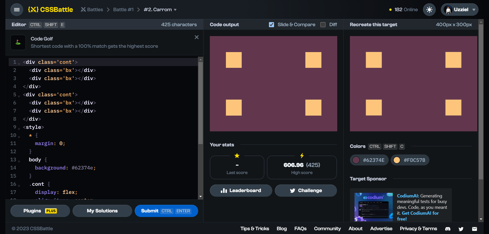

# Battle #1 - Pilot Battle

## #2 - Carrom

[Link to problem](https://cssbattle.dev/play/2)



### My Solution

```html
<div class='cont'>
    <div class='bx'></div>
    <div class='bx'></div>
  </div>
  <div class='cont'>
    <div class='bx'></div>
    <div class='bx'></div>
  </div>
  <style>
    * {
      margin: 0;
    }
    body {
      background: #62374e;
    }
    .cont {
      display: flex;
      align-items: center;
      justify-content: center;
      gap: 12.5rem;
      height: 50%;
    }
    .bx {
      height: 50px;
      width: 50px;
      background: #fdc57b;
    }
  </style>
```
