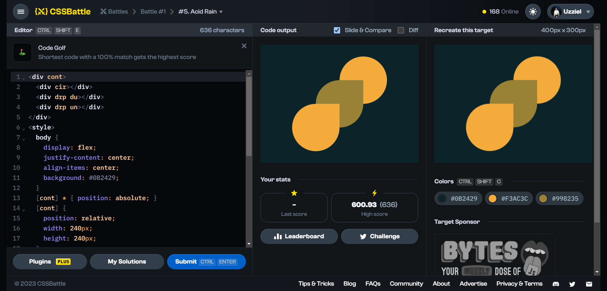

# Battle #1 - Pilot Battle

## #5 - Acid Rain

[Link to problem](https://cssbattle.dev/play/5)



### My Solution

```html
<div cont>
    <div cir></div>
    <div drp du></div>
    <div drp un></div>
</div>
<style>
    body {
        display: flex;
        justify-content: center;
        align-items: center;
        background: #0B2429;
    }
    [cont] * { position: absolute; }
    [cont] {
        position: relative;
        width: 240px;
        height: 240px;
    }
    [drp], [cir] {
        height: 120px;
        width: 120px;
    }
    [drp] { border-radius: 50% 0 50% 50%; }
    [un] { bottom: 0; }
    [du] {
        top: 50%;
        left: 50%;
        transform: translate(-50%, -50%);
        background: #998235;
    }
    [cir] { 
        right: 0;
        border-radius: 50%; 
    }
    [un], [cir] { background: #F3AC3C; }
</style>
```
