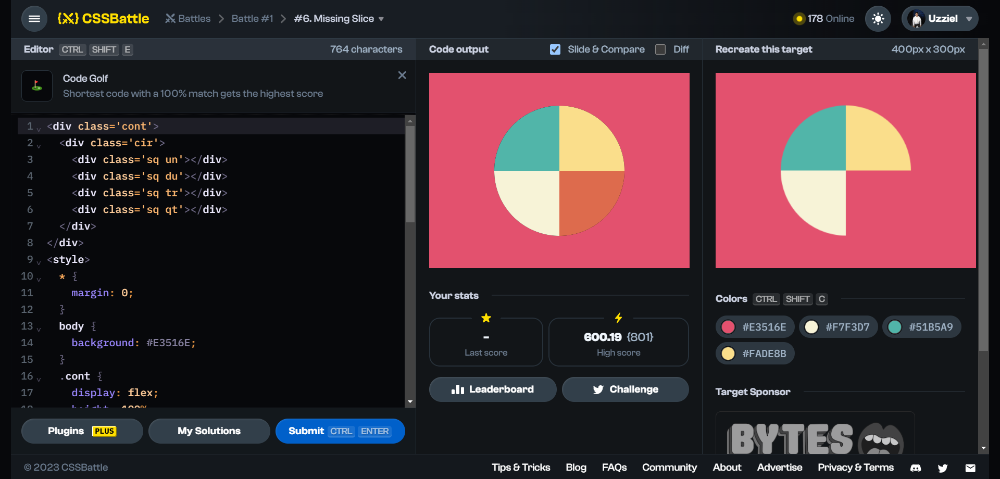

# Battle #1 - Pilot Battle

## #6 - Missing Slice

[Link to problem](https://cssbattle.dev/play/6)



### My Solution

```html
<div class='cont'>
  <div class='cir'>
    <div class='sq un'></div>
    <div class='sq du'></div>
    <div class='sq tr'></div>
    <div class='sq qt'></div>
  </div>
</div>
<style>
  * {
    margin: 0;
  }
  body {
    background: #E3516E;
  }
  .cont {
    display: flex;
    height: 100%;
    justify-content: center;
    align-items: center;
  }
  .cir {
    overflow: hidden;
    display: flex;
    flex-wrap: wrap;
    position: absolute;
    border-radius: 50%;
    background: black;
    height: 200px;
    width: 200px;
  }
  .sq {
    width: 100px;
    height: 100px;
    background: #dd6b4d;
  }
  .un {
    background: #51B5A9;
  }
  .du {
    background: #FADE8B;
  }
  .tr {
    background: #F7F3D7;
  }
  .un {
    background: #51B5A9;
  }
</style>
```
