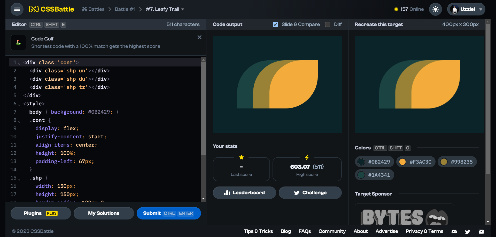

# Battle #1 - Pilot Battle

## #7 - Leafy Trail

[Link to problem](https://cssbattle.dev/play/7)



### My Solution

```html
<div class='cont'>
  <div class='shp un'></div>
  <div class='shp du'></div>
  <div class='shp tr'></div>
</div>
<style>
  body { background: #0B2429; }
  .cont {
    display: flex;
    justify-content: start;
    align-items: center;
    height: 100%;
    padding-left: 67px;
  }
  .shp {
    width: 150px;
    height: 150px;
    border-radius: 100px 0;
    background: #dd6b4d;
    margin-right: -100px;
  }
  .un { background: #1A4341; }
  .du { background: #998235; }
  .tr { background: #F3AC3C; }
</style>
```
