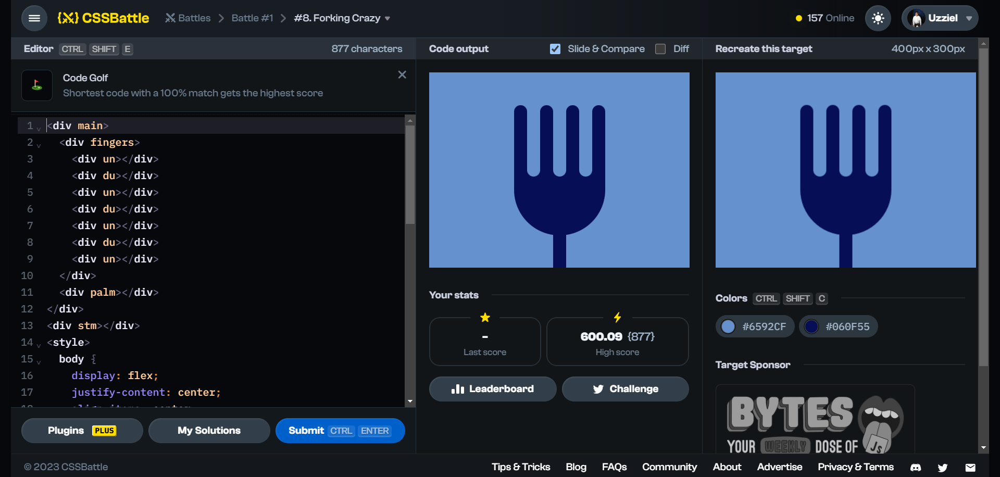

# Battle #1 - Pilot Battle

## #8 - Forking Crazy

[Link to problem](https://cssbattle.dev/play/8)



### My Solution

```html
<div main>
  <div fingers>
    <div un></div>
    <div du></div>
    <div un></div>
    <div du></div>
    <div un></div>
    <div du></div>
    <div un></div>
  </div>
  <div palm></div>
</div>
<div stm></div>
<style>
  body {
    display: flex;
    justify-content: center;
    align-items: center;
    background: #6592CF;
  }
  [fingers] { display: flex; }
  [fingers] * { width: 20px; }
  [fingers] [un] {
    height: 110px;
    background: #060F55;
    border-radius: 20px 20px 0 0 
  }
  [fingers] [du] { 
    height: 110px;
    background: #6592CF;
    border-radius: 0 0 20px 20px;
  }
  [palm] {
    height: 110px;
    width: 140px;
    background: #060F55;
    border-radius: 0 0 100px 100px;
    margin-top: -20px;
    z-index: -1;
  }
  [stm] {
    position: absolute;
    height: 80px;
    width: 20px; 
    background: #060F55;
    margin-top: 220px
  }
</style>
```
