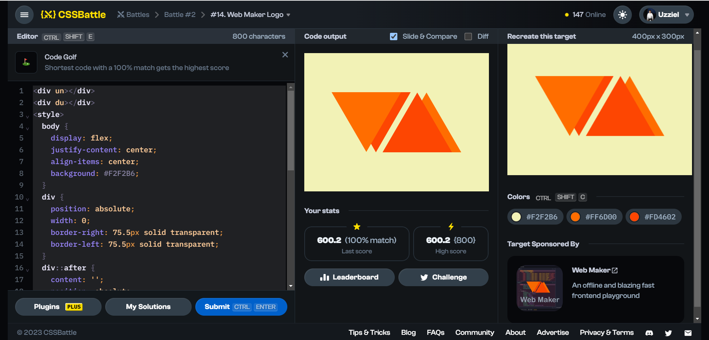

# Battle #2 - Visibility

## #14 - Web Maker Logo

[Link to problem](https://cssbattle.dev/play/14)



### My Solution

```html
<div un></div>
<div du></div>
<style>
  body {
    display: flex;
    justify-content: center;
    align-items: center;
    background: #F2F2B6;
  }
  div {
    position: absolute;
    width: 0;
    border-right: 75.5px solid transparent;
    border-left: 75.5px solid transparent;
  }
  div::after {
    content: '';
    position: absolute;
    width: 0;
    border-right: 75.5px solid transparent;
    border-left: 75.5px solid transparent;
  }
  [un] {
    border-top: 130.5px solid #FD4602;
    left: 80px;
  }
  [du] {
    border-top: 130px solid #FF6D00;
    right: 60px;
  }
  [un]::after {
    border-top: 130px solid #FF6D00;
    top: -130.5px;
    left: -96px;
  }
  [du]::after {
    border-top: 130px solid #FD4602;
    top: -130px;
    left: -55px;
  }
  [du] { rotate: 180deg;}
</style>
```
