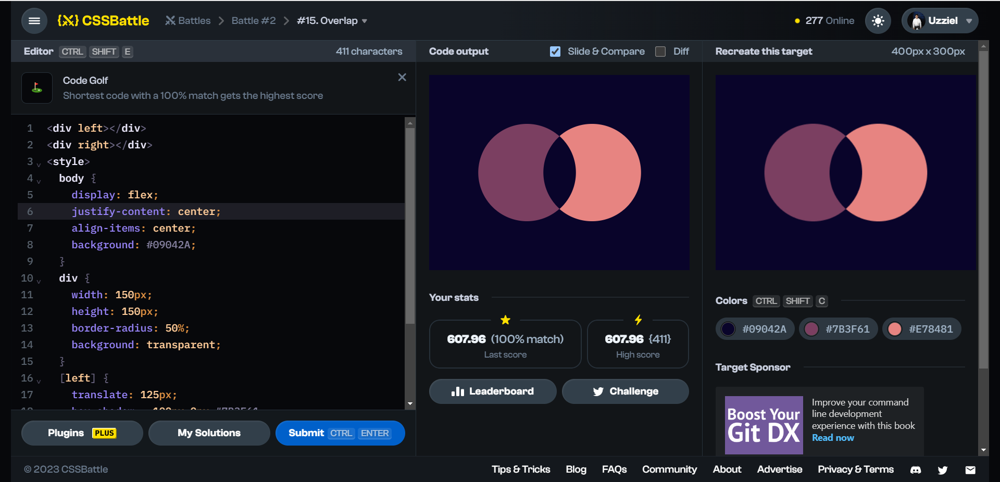

# Battle #2 - Visibility

## #15 - Overlap

[Link to problem](https://cssbattle.dev/play/15)



### My Solution

```html
<div left></div>
<div right></div>
<style>
  body {
    display: flex;
    justify-content: center;
    align-items: center;
    background: #09042A;
  }
  div {
    width: 150px;
    height: 150px;
    border-radius: 50%;
    background: transparent;
  }
  [left] {
    translate: 125px;
    box-shadow: -100px 0px #7B3F61;
  }
  [right] {
    translate: -125px;
    box-shadow: 100px 0px #E78481;
  }
</style>
```
