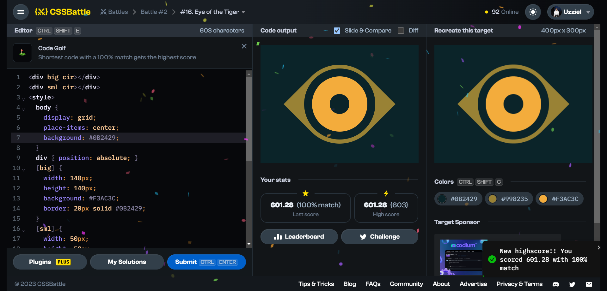

# Battle #2 - Visibility

## #16 - Eye of the Tiger

[Link to problem](https://cssbattle.dev/play/16)



### My Solution

```html
<div big cir></div>
<div sml cir></div>
<style>
  body {
    display: grid;
    place-items: center;
    background: #0B2429;
  }
  div { position: absolute; }
  [big] {
    width: 140px;
    height: 140px;
    background: #F3AC3C;
    border: 20px solid #0B2429;
  }
  [sml] {
    width: 50px;
    height: 50px;
    background: #0B2429;
  }
  [cir] {border-radius: 50%;}
  [big]::before {
    content: '';
    position: absolute;
    top: -30px;
    left: -30px;
    width: 200px;
    height: 200px;
    background: #998235;
    z-index: -1;
    border-radius: 0 100px;
    rotate: 135deg;
  }
</style>
```
