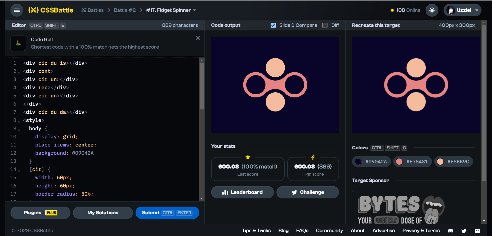

# Battle #2 - Visibility

## #17 - Fidget Spinner

[Link to problem](https://cssbattle.dev/play/17)



### My Solution

```html
<div cir du is></div>
<div cont>
<div cir un></div>
<div rec></div>
<div cir un></div>
</div>
<div cir du da></div>
<style>
  body {
    display: grid;
    place-items: center;
    background: #09042A
  }
  [cir] {
    width: 60px;
    height: 60px;
    border-radius: 50%;
  }
  [cont] {
    position: absolute;
    display: flex;
    justify-content: space-between;
    align-items: center;
    padding: 0 10px;
    height: 80px;
    width: 200px;
    border-radius: 80px;
    z-index: -1;
  }
  [rec] {
    position: absolute;
    left: 80px;
    width: 60px;
    height: 45px;
    background: #E78481;
    z-index: -1;
  }
  [cir][un] { 
    border: 10px solid #E78481;
    background:#09042A;
    z-index: -1;
  }
  [cir][du] {
    position: absolute;
    border: 11px solid #09042A;
    background: #F5BB9C;
  }
  [cir][du][is] { top: 56px;}
  [cir][du][da] { bottom: 56px;}
</style>
```

#### Notes

- I'm not satisfied with this solution.
