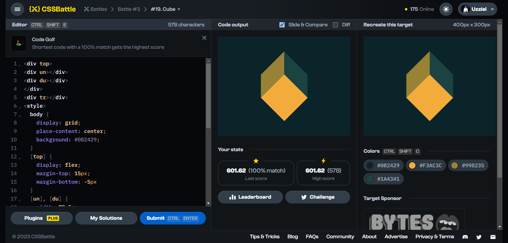

# Battle #3 - Cursor

## #19 - Cube

[Link to problem](https://cssbattle.dev/play/19)



### My Solution

```html
<div top>
<div un></div>
<div du></div>
</div>
<div tr></div>
<style>
  body {
    display: grid;
    place-content: center;
    background: #0B2429;
  }
  [top] {
    display: flex;
    margin-top: 15px;
    margin-bottom: -5px
  }
  [un], [du] {
    width: 70.5px;
    height: 70.5px;
  }
  [un] {
    background: #998235;
    transform: skew(0, 135deg)
  }
  [du] {
    background: #1A4341;
    transform: skew(0, 45deg)
  }
  [tr] {
    width: 100px;
    height: 100px;
    background: #F3AC3C;
    margin-top: -10px;
    margin-left: 20.5px;
    rotate: 45deg;
  }
</style>
```

#### Takeaway

- Use Transform: skew() property to skew shapes
  