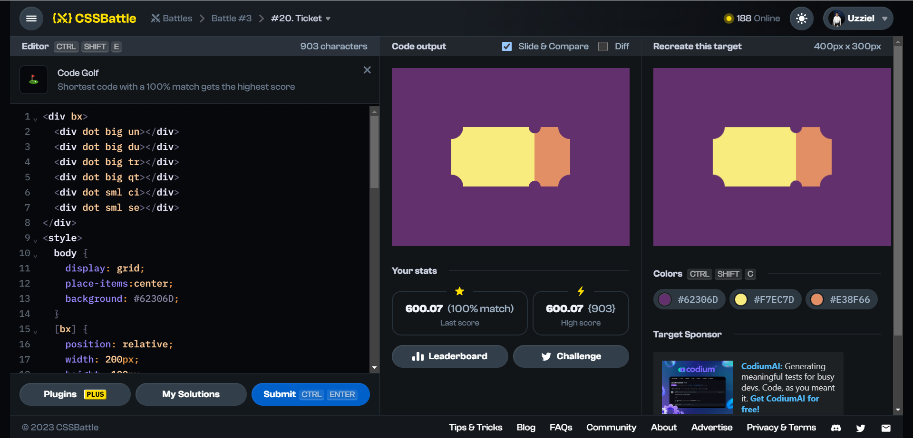

# Battle #3 - Cursor

## #20 - Ticket

[Link to problem](https://cssbattle.dev/play/20)



### My Solution

```html
<div bx>
  <div dot big un></div>
  <div dot big du></div>
  <div dot big tr></div>
  <div dot big qt></div>
  <div dot sml ci></div>
  <div dot sml se></div>
</div>
<style>
  body {
    display: grid;
    place-items:center;
    background: #62306D;
  }
  [bx] {
    position: relative;
    width: 200px;
    height: 100px;
    background: linear-gradient(to right, #F7EC7D 70%, #E38F66 30%);
    border-radius: -50%;
  }
  [dot] {
    position: absolute;
    border-radius: 50%;
    background: #62306D;
  }
  [big] {
    width: 40px;
    height: 40px;
  }
  [un] { 
    top: -20px;
    left: -20px;
  }
  [du] {
    bottom: -20px;
    left: -20px;
  }
  [tr] {
    top: -20px;
    right: -20px;
  }
  [qt] {
    bottom: -20px;
    right: -20px;
  }
  [sml] {
    height: 20px;
    width: 20px;
  }
  [ci] {
    top: -10px;
    right: 50px
  }
  [se] {
    bottom: -10px;
    right: 50px;
  }
</style>
```
