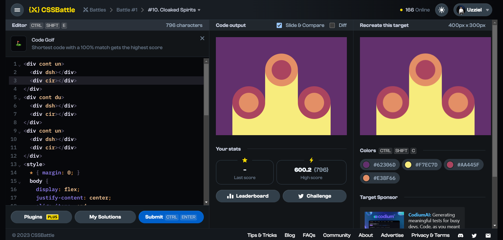

# Battle #1 - Pilot Battle

## #10 - Cloaked Spirits

[Link to problem](https://cssbattle.dev/play/10)



### My Solution

```html
<div cont un>
  <div dsh></div>
  <div cir></div>
</div>
<div cont du>
  <div dsh></div>
  <div cir></div>
</div>
<div cont un>
  <div dsh></div>
  <div cir></div>
</div>
<style>
  * { margin: 0; }
  body {
    display: flex;
    justify-content: center;
    align-items: end;
    background: #62306D;
  }
  [cont] {position: relative;}
  [cir] {
    height: 60px;
    width: 60px;
    border-radius: 50%;
  }
  [un] [cir] {
    background: #E38F66;
    border: 20px solid #AA445F;
    margin-bottom: 50px
  }
  [du] [cir] {
    background: #AA445F;
    border: 20px solid #E38F66;
    margin-bottom: 150px
  }
  [dsh] {
    position: absolute;
    bottom: 0;
    width: 100px;
    background: #F7EC7D;
    z-index: -1;
  }
  [un] [dsh] { height: 100px; }
  [du] [dsh] { height: 200px; }
</style>
```
