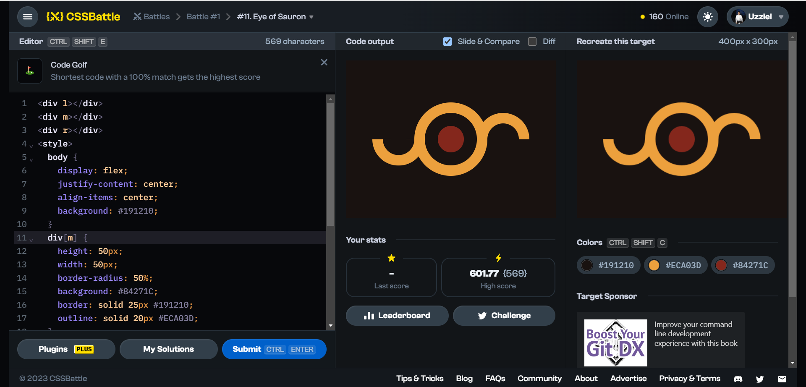

# Battle #1 - Pilot Battle

## #11 - Eye of Sauron

[Link to problem](https://cssbattle.dev/play/11)



### My Solution

```html
<div l></div>
<div m></div>
<div r></div>
<style>
  body {
    display: flex;
    justify-content: center;
    align-items: center;
    background: #191210;
  }
  div[m] {
    height: 50px;
    width: 50px; 
    border-radius: 50%;
    background: #84271C;
    border: solid 25px #191210;
    outline: solid 20px #ECA03D;
  }
  div[l], div[r] {
    height: 30px;
    width: 60px;
    border-radius: 50px 50px 0 0;
    border: 20px solid #ECA03D;
    border-bottom: 0;
  }
  div[l] {
    rotate: 180deg;
    margin-top: 50px;
  }
  div[r] { margin-bottom: 50px}
</style>
```
